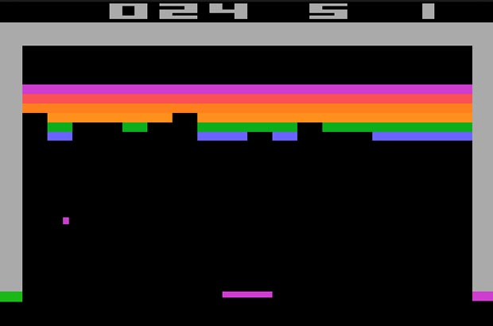

# Game Clone Challenges

A progressive list of games clones for the practicing programmer.

## Contents

- [Tic-Tac-Toe](#tic-tac-toe)
- [Duck Hunt](#duck-hunt)
- [Pong](#pong)
- [Tetris](#tetris)
- [Breakout](#breakout)
- [Space Invaders](#space-invaders)
- [Galaga](#galaga)
- [Pac-Man](#pac-man)
- [Scramble](#scramble)
- [Warcraft](#warcraft-orcs--humans)
- [Wolfenstein 3D](#wolfenstein-3d)
- [Doom](#doom)

## Tic-Tac-Toe

From Wikipedia:
> Tic-tac-toe (also known as noughts and crosses or Xs and Os) is a paper-and-pencil game for two players, X and O, who take turns marking the spaces in a 3×3 grid. The player who succeeds in placing three of their marks in a horizontal, vertical, or diagonal row wins the game.

### Requirements

* Main Menu
  * Start Game option
* Game Over screen
  * Add an option to play again
  * Add an option to exit game

### Challenges

* Use your framework of choice to draw the board, X, and O.
* Add a 2 player mode
  * Add the option to the Main Menu
* Sound Effects
  * Add sound effects for placing down X and O
* Add who won to Game Over screen (i.e. Player, Computer, Player 1, or Player 2)  
  
### Resources
- [Wikipedia - Tic-Tac-Toe](https://en.wikipedia.org/wiki/Tic-tac-toe)

## Duck Hunt

From Wikipedia:
> Duck Hunt is a light gun shooter video game developed and published by Nintendo for the Nintendo Entertainment System (NES) video game console. First released in Japan on April 21, 1984, it was later released on October 18, 1985 in North America as a launch game for the NES, and on August 15, 1987 in Europe. The game was released as a Virtual Console title for the Wii U in 2014.

### Resources
- [Wikipedia - Duck Hunt](https://en.wikipedia.org/wiki/Duck_Hunt)
- [Gameplay Video](https://www.youtube.com/watch?v=ZPLNxy7oel8)

## Pong

From Wikipedia:
> Pong is one of the earliest arcade video games. It is a table tennis sports game featuring simple two-dimensional graphics. The game was originally manufactured by Atari, which released it in 1972. Allan Alcorn created Pong as a training exercise assigned to him by Atari co-founder Nolan Bushnell. Bushnell based the idea on an electronic ping-pong game included in the Magnavox Odyssey, which later resulted in a lawsuit against Atari. Surprised by the quality of Alcorn's work, Bushnell and Atari co-founder Ted Dabney decided to manufacture the game.

### Resources
- [Wikipedia - Pong](https://en.wikipedia.org/wiki/Pong)
- [Gameplay Video](https://www.youtube.com/watch?v=fiShX2pTz9A)

## Tetris

From Wikipedia
> Tetris is a tile-matching puzzle video game, originally designed and programmed by Russian game designer Alexey Pajitnov. It was released on June 6, 1984, while he was working for the Dorodnitsyn Computing Centre of the Academy of Science of the Soviet Union in Moscow. He derived its name from the Greek numerical prefix tetra- (all of the game's pieces contain four segments) and tennis, Pajitnov's favorite sport.

### Resources
- [Wikipedia - Tetris](https://en.wikipedia.org/wiki/Tetris)
- [Gameplay Video]()

## Breakout

From Wikipedia:
> Breakout is an arcade game developed and published by Atari, Inc., released on May 13, 1976. It was conceptualized by Nolan Bushnell and Steve Bristow, influenced by the 1972 Atari arcade game Pong, and built by Steve Wozniak aided by Steve Jobs. The game was ported to multiple platforms and upgraded to video games such as Super Breakout. In addition, Breakout was the basis and inspiration for certain aspects of the Apple II personal computer.

### Resources
- [Wikipedia - Breakout](https://en.wikipedia.org/wiki/Breakout_(video_game))
- [Gameplay Video](https://www.youtube.com/watch?v=JRAPnuwnpRs)
- [How Steve Wozniak Created Breakout](https://www.youtube.com/watch?v=17eUExffa5w)

## Space Invaders

Form Wikipedia:
> Space Invaders is an arcade video game created by Tomohiro Nishikado and released in 1978. It was originally manufactured and sold by Taito in Japan, and was later licensed for production in the United States by the Midway division of Bally. Space Invaders is one of the earliest shooting games and the aim is to defeat waves of aliens with a laser cannon to earn as many points as possible. In designing the game, Nishikado drew inspiration from popular media: Breakout, The War of the Worlds, and Star Wars. To complete it, he had to design custom hardware and development tools.

### Resources
- [Wikipedia - Space Invaders](https://en.wikipedia.org/wiki/Space_Invaders)
- [Gameplay Video](https://www.youtube.com/watch?v=vYMent6mg_c)

## Galaga

From Wikipedia:
> Galaga is a Japanese shoot-'em-up arcade game developed and published by Namco Japan and by Midway in North America in 1981. It is the sequel to 1979's Galaxian. The gameplay of Galaga puts the player in control of a spacecraft which is situated at the bottom of the screen, with enemy aliens arriving in formation at the beginning of a stage, either trying to destroy, collide with, or capture the spaceship, with the player progressing every time alien forces are vanquished.

### Resources
- [Wikipedia - Galaga](https://en.wikipedia.org/wiki/Galaga)
- [Steam - Galaga](http://store.steampowered.com/app/403430/ARCADE_GAME_SERIES_GALAGA/)
- [Gameplay Video](https://www.youtube.com/watch?v=dvjapcHsqXY)

## Pac-Man

From Wikipedia:
> Pac-Man is an arcade game developed by Namco and first released in Japan in May 1980. It was created by Japanese video game designer Toru Iwatani. It was licensed for distribution in the United States by Midway Games and released in October 1980. Immensely popular from its original release to the present day, Pac-Man is considered one of the classics of the medium, and an icon of 1980s popular culture. Upon its release, the game—and, subsequently, Pac-Man derivatives—became a social phenomenon that yielded high sales of merchandise and inspired a legacy in other media, such as the Pac-Man animated television series and the top-ten Buckner and Garcia hit single "Pac-Man Fever". Pac-Man was popular in the 1980s and 1990s and is still played in the 2010s.

### Resources
- [Wikipedia - Pac-Man](https://en.wikipedia.org/wiki/Pac-Man)
- [Steam - Pac-Man](http://store.steampowered.com/app/394160/ARCADE_GAME_SERIES_PACMAN/)
- [Gameplay Video](https://www.youtube.com/watch?v=uswzriFIf_k)

## Scramble

From Wikipedia:
> Scramble is a 1981 side-scrolling shoot 'em up arcade game. It was developed by Konami, and manufactured and distributed by Leijac in Japan and Stern in North America. It was the first side-scrolling shooter with forced scrolling and multiple distinct levels. The Konami Scramble arcade system board hardware uses two Zilog Z80 microprocessors for the central processing unit, two AY-3-8910 sound chips for the sound, and Namco Galaxian video hardware for the graphics.

### Resources
- [Wikipedia - Scramble](https://en.wikipedia.org/wiki/Scramble_(video_game))
- [Gameplay Video](https://www.youtube.com/watch?v=m-PDf1Su6gA)

## Warcraft: Orcs & Humans

From Wikipedia:
> Warcraft: Orcs & Humans is a real-time strategy game (RTS), developed by Blizzard Entertainment and published by Blizzard and Interplay Productions. The MS-DOS version was released on 23 November 1994 and the Macintosh version in early 1996. Sales were fairly high, reviewers were mostly impressed, and the game won three awards and was a finalist for three others. There was a CD re-release, namely version 1.21 (CD version), that didn't have the word-from-the-user-manual copy protection of prior versions. The sequel, Warcraft II: Tides of Darkness, became the main rival to Westwood Studios' Command & Conquer series, and this competition fostered an RTS boom in the mid to late 1990s.

### Resources
- [Warcraft](https://en.wikipedia.org/wiki/Warcraft:_Orcs_%26_Humans)
- [Gameplay Video](https://www.youtube.com/playlist?list=PL8EEB4A96283FB8CF)

## Wolfenstein 3D

From Wikipedia:
> Wolfenstein 3D is a first-person shooter video game developed by id Software and published by Apogee Software and FormGen. Originally released on May 5, 1992 for MS-DOS, it was inspired by the 1981 Muse Software video game Castle Wolfenstein, and is the third installment in the Wolfenstein series. In Wolfenstein 3D, the player assumes the role of Allied spy William "B.J." Blazkowicz during World War II as he escapes from the Nazi German prison Castle Wolfenstein and carries out a series of crucial missions against the Nazis. The player traverses through each of the game's levels to find an elevator to the next level or kill a final boss, fighting Nazi soldiers, dogs, and other enemies with knives, pistols, and other guns.

### Resources
- [Wikipedia - Wolfenstein 3D](https://en.wikipedia.org/wiki/Wolfenstein_3D)
- [Steam - Wolfenstein 3D](http://store.steampowered.com/app/2270/Wolfenstein_3D/)
- [Gameplay Video](https://www.youtube.com/watch?v=561sPCk6ByE)
- [Wolfenstein 3D's Source Code](https://github.com/id-Software/wolf3d)
- [Game Engine Black Book: Wolfenstein 3D](https://www.amazon.com/dp/1539692876)

## Doom

From Wikipedia:
> Doom (typeset as DOOM in official documents)[1] is a 1993 science fiction horror-themed first-person shooter (FPS) video game by id Software. It is considered one of the most significant and influential titles in video game history, for having helped to pioneer the now-ubiquitous first-person shooter. The original game was divided into three nine-level episodes and was distributed via shareware and mail order. The Ultimate Doom, an updated release of the original game featuring a fourth episode, was released in 1995 and sold at retail.

### Resources
- [Wikipedia - Doom](https://en.wikipedia.org/wiki/Doom_(1993_video_game))
- [Steam - Doom](http://store.steampowered.com/app/2280/Ultimate_Doom/)
- [Gameplay Video](https://www.youtube.com/watch?v=FMK0znPb6Dc)
- [Doom's Source Code](https://github.com/id-Software/DOOM)

## References

> - [Starting out on Game Programming](http://lazyfoo.net/articles/article01/index.php)  
> - [How do I make games? A Path to Game Development](https://www.gamedev.net/articles/programming/general-and-gameplay-programming/how-do-i-make-games-a-path-to-game-development-r892)
> - ["I Need Practice Programming": 49 Ideas for Game Clones to Code](http://inventwithpython.com/blog/2012/02/20/i-need-practice-programming-49-ideas-for-game-clones-to-code/)
> - [What are good games to “earn your wings” with?](https://gamedev.stackexchange.com/a/945)
> - [GameDev Challenges](https://www.gamedev.net/forums/forum/81-gamedev-challenges/)
